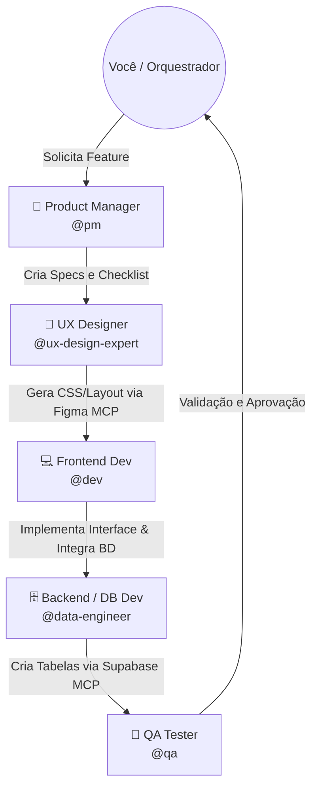

# Exemplo Prático: Squad de IA com `.aios-core` e MCPs

Para visualizar o poder do **.aios-core** combinado com **MCPs**, vamos simular a esteira de desenvolvimento de uma nova funcionalidade: **"Criar um formulário de captura de Leads de alta conversão"**. 

Neste exemplo, você (CEO/Orquestrador) não vai escrever o banco de dados, nem codar o form e nem testar. Você apenas vai pedir a feature.

---

## 👥 A Estrutura do Seu Squad

Visualmente, o seu time operando dentro da pasta `.aios-core/development/agents/` se parece com isso:

---

## ⚙️ O Chão de Fábrica (O Workflow na Prática)

Aqui está o que o **.aios-core** entrega em cada etapa desse fluxo (Workflow) através de **Auto-Handoff Protocol**:

### 1. Etapa de Produto (@pm)
Você envia: *"Quero um formulário de captura de leads (Nome, Email, Telefone) para nossa landing page, focado em alta conversão."*
- **O que ele faz:** Cria o arquivo físico `docs/stories/lead-form-story.md`. 
- **Entregável AIOS:** Um checklist claro do que precisa ser feito, requisitos de segurança (GDPR/LGPD), e regras de negócio.
- **Handoff (Passagem de Bastão):** O PM finaliza atualizando a história e diz: *"Fluxo .aios-core: Requisitos definidos. Pronto para o [Modo Designer] extrair o design system e propor o layout."*

### 2. Etapa de Design (@ux-design-expert + Figma MCP)
O PM passa a bola. O UX entra em cena.
- **O que ele faz:** Usa a ferramenta (MCP) do **Figma**. Ele busca no Figma onde está o componente visual "Input" e "Button". Ele lê o arquivo do Figma via API e traduz para código.
- **Entregável AIOS:** Gera a base dos estilos (Tailwind ou CSS puro) garantindo que as cores (Hex) e fontes sejam as oficiais da Konig Systems.
- **Handoff:** Atualiza o `lead-form-story.md` (check `[x] Design tokens gerados`) e avisa: *"Pronto para o [Modo Desenvolvedor] montar a estrutura React/Angular."*

### 3. Etapa de Desenvolvimento Backend/DB (@data-engineer + Supabase MCP)
- **O que ele faz:** Usa a ferramenta (MCP) do **Supabase**. Ele não te pede para abrir o painel do Supabase. Ele mesmo gera a query de SQL e a executa diretamente no servidor de homologação para criar a tabela `leads` via MCP.
- **Entregável AIOS:** Tabela criada no ambiente e tipos RLS (Security) aplicados na base de dados.
- **Handoff:** Atualiza o checklist e aciona o Frontend.

### 4. Etapa de Desenvolvimento Frontend (@dev)
O Dev precisa plugar o formulário na tabela recém-criada pelo Data Engineer, com as cores feitas pelo UX.
- **O que ele faz:** Puxa os Design Tokens criados pelo Designer e a estrutura do Supabase gerada pelo DB. Cria o componente TypeScript/HTML e faz o bind da lógica de salvar no banco de dados.
- **Entregável AIOS:** O código do componente (ex: `LeadForm.tsx` ou `.ts`) pronto e funcional.
- **Handoff:** *"Fluxo .aios-core: Implementação do form concluída. Pronto para o [Modo QA] validar tipagem, renderização e fluxo de erro."*

### 5. Etapa de Qualidade e Testes (@qa)
O Engenheiro de Qualidade entra para tentar "quebrar" o que o @dev fez.
- **O que ele faz:** Roda o linter `npm run lint`, verifica os tipos Typescript, e analisa o componente em busca de falhas. (Ex: "O que acontece se o usuário enviar sem preencher o telefone?").
- **Entregável AIOS:** Corrige bugs pequenos sozinhos ou abre apontamentos no arquivo de checklist para o @dev arrumar.
- **Handoff Final:** *"Fluxo .aios-core: Tarefa exaustivamente validada. Tabela populada corretamente em homologação. Checklist do story-1 concluído. Submetendo para [Você/Orquestrador] realizar o deploy."*

---

## 🚀 Resumo: O que o AIOS te entrega como Valor?

1. **Memória Corporal (Zero Alucinação):** Ao invés de uma IA misturar banco de dados com CSS na mesma conversa de forma caótica, você dividiu o problema. O código gerado é extremamente limpo.
2. **Histórico e Previsibilidade:** Tudo o que o Squad faz é gravado em arquivos físicos de `stories` e `checklists`. Se algo der errado, você volta na "prancheta" do PM e altera o requisito.
3. **Poder de Execução no Mundo Real:** Com o **MCP**, o banco de dados é realmente alterado e o design do Figma é de fato lido.
4. **Alavancagem Máxima:** O seu tempo é focado *exclusivamente* em orquestrar e revisar a estratégia, enquanto Agentes especialistas trocam os arquivos e configuram a "obra" sozinhos no chão de fábrica da sua aplicação.
